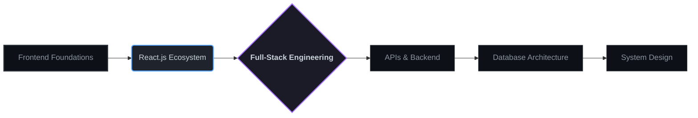

<!-- Terminal Window Style Hero -->
<table width="100%" style="border-collapse: collapse;">
  <tr>
    <td style="background-color: #1a1b26; border-radius: 8px 8px 0 0; padding: 10px; border: 1px solid #292e42;">
      

        🔴 🟡 🟢 
      

    </td>
  </tr>
  <tr>
    <td style="background-color: #0d1117; padding: 40px 20px; border: 1px solid #292e42; border-top: none; border-radius: 0 0 8px 8px;">
      <h1 style="margin: 0; font-size: 3em; font-weight: 800; letter-spacing: -1px; color: #c9d1d9;">
        AKASH KUMAR
      </h1>
      <h3 style="margin: 10px 0 20px; font-weight: 400; color: #58a6ff;">
        Full-Stack Web Developer
      </h3>
      

        Building practical web applications and advancing toward end-to-end software engineering.
      

      

        
        
        
        
      

    </td>
  </tr>
</table>

 

<table width="100%" style="border-collapse: collapse; border: none;">
  <tr>
    <td width="33%" valign="top" style="border: 1px solid #30363d; padding: 15px; border-radius: 6px; background-color: #0d1117;">
      <h3 style="margin-top: 0; color: #58a6ff;">› Who I Am</h3>
      
A developer focused on architecting modern web applications, transitioning from frontend interfaces to robust full-stack systems.

    </td>
    <td width="33%" valign="top" style="border: 1px solid #30363d; padding: 15px; border-radius: 6px; background-color: #0d1117;">
      <h3 style="margin-top: 0; color: #a371f7;">› What I Build</h3>
      
Database-driven web platforms, responsive user interfaces, and practical e-commerce solutions that solve real problems.

    </td>
    <td width="33%" valign="top" style="border: 1px solid #30363d; padding: 15px; border-radius: 6px; background-color: #0d1117;">
      <h3 style="margin-top: 0; color: #3fb950;">› What I'm Learning</h3>
      
Advanced React.js patterns, scalable backend architecture, and seamless API integrations to complete the full-stack loop.

    </td>
  </tr>
</table>

 

## ⚡ Tech Ecosystem

  
| 🌐 Frontend & UI | ⚙️ Backend & Data | 🛠️ Tools & Workflow | 💻 Core Languages |
| :---: | :---: | :---: | :---: |
|   &nbsp; |   &nbsp; |   &nbsp; |   &nbsp; |

 

## 🐍 Daily Contribution Activity

  <picture>
    <source media="(prefers-color-scheme: dark)" srcset="https://raw.githubusercontent.com/akashkmr07/akashkmr07/output/github-contribution-grid-snake-dark.svg">
    <source media="(prefers-color-scheme: light)" srcset="https://raw.githubusercontent.com/akashkmr07/akashkmr07/output/github-contribution-grid-snake.svg">
    
  </picture>

 

## 🗺️ Development Roadmap

  
Currently transitioning from frontend ecosystems into comprehensive full-stack engineering.

 

## 🧠 Engineering Mindset

  

    BUILD &nbsp;→&nbsp; 
    DEBUG &nbsp;→&nbsp; 
    UNDERSTAND &nbsp;→&nbsp; 
    IMPROVE &nbsp;→&nbsp; 
    REPEAT
  

 

  

    
    &nbsp;&nbsp;&nbsp;
    
    &nbsp;&nbsp;&nbsp;
    
    &nbsp;&nbsp;&nbsp;
    
  

  

    Building today. Improving with every commit.
  

